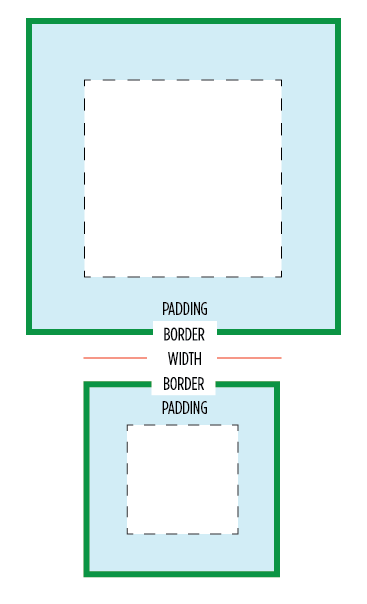

# About `* { box-sizing: border-box; }`



## Syntax

- `box-sizing: content-box`

The `width` and `height` properties are measured including only the content, but not the padding, border or margin.

- `box-sizing: border-box`

The `width` and `height` properties include the padding and border, but not the margin. 这和 IE 的[怪异模式](https://github.com/L-movingon/prepare-for-interview/blob/master/HTML/whats-the-difference-between-standards-mode-and-quirks-mode.md)下的盒模型是一样。

## Advantages

一旦设定了元素的 `width` 和 `height`，不管我怎么设置我的 `border` 和 `padding`，都不会对元素的大小造成影响，这样既不用再为 content 去苦苦的计算宽高，也不会影响到其他元素的布局，会使布局更加容易和直观

想像一下你要弄一个两列的布局，左边的为30%, 右边的为70%

  ```css
  .left {
    float: left;
    width: 30%;
    background: pink;
    border: 3px red solid;
    height: 150px;
  }
  .right {
    float: left;
    background: lightgreen;
    width: 70%;
    border: 3px green solid;
    height: 150px;
  }
  ```
  
  ```html
  <div class="left"></div>
  <div class="right"></div>
  ```

这样的话，你就会发现第二个盒子就会到下一行，因为 `border` 会使元素大于 100%

所以现在都推荐这样，让所有元素都符合 `border-box`

```css
html {
  box-sizing: border-box;
}
*, *:before, *:after {
  box-sizing: inherit;
}
```

如果哪个组件的 `box-sizing` 是默认的话，我们只要对特定的添加样式 `box-sizing: content-box;`

## Browser compatibility

if you need to support older versions of Safari (< 5.1), Chrome (< 10), and Firefox (< 29), you should include the prefixes -webkit and -moz, like this:

```css
html {
  -webkit-box-sizing: border-box;
  -moz-box-sizing: border-box;
  box-sizing: border-box;
}
*, *:before, *:after {
  -webkit-box-sizing: inherit;
  -moz-box-sizing: inherit;
  box-sizing: inherit;
}
```

似乎 IE 在以前也做对过一些事 :)

Refenrence

- [*{box-sizing: border-box} FTW](http://www.paulirish.com/2012/box-sizing-border-box-ftw/)
- [The Revenge of the IE Box Model](http://www.jefftk.com/p/the-revenge-of-the-ie-box-model)
- [Box Sizing](https://css-tricks.com/box-sizing/)
