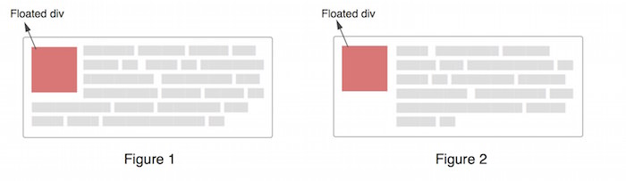

# Block Formatting Context

> Floats, absolutely positioned elements, block containers (such as inline-blocks, table-cells, and table-captions) that are not block boxes, and block boxes with 'overflow' other than 'visible' (except when that value has been propagated to the viewport) establish new block formatting contexts for their contents.

## How to create a BFC

简单来说，但元素有下面任意一条 CSS 属性值的时候，你就得到了一个 BFC

- **float:** left/right
- **overflow:** hidden/auto/scroll
- **display:** table-cell and any of the related values/inline-block/flex/inline-flex
- **position:** absolute/fixed

## What does this mean in the real world

###1. Block formatting contents prevent margin collapsing

要明白这部分，首先要明白什么是 margin collapsing

margin collapsing 分为两种：

1. 两个相邻元素之间的 margin collapsing

  当两个相邻元素之间的 `margin` 都为正数的时候，两个元素之间的 `margin` 就是两者中较大的一个。一个简单的例子

  ```html
  <h1>Heading Content</h1>
  <p>Paragraph content</p>
  ```

  ```css
  h1 {
    margin-bottom: 25px;
    background: #cfc;
  }

  p {
    margin-top: 20px;
    background: #cf9;
  }
  ```

  这个时候，h1 和 p 上下的 `margin` 距离就为 25px

  当两个相邻元素之间的 `margin` 有一个或者两个为负的时候，两个元素之间的 `margin` 就是两者的和，还是上面那个例子

  ```css
  p {
    margin-top: -20px;
    background: #cf9;
  }
  ```

  这个时候，h1 和 p 上下的 `margin` 距离就为 5px

2. 父元素和第一个子元素之间的 margin collapsing

  当父元素的 `margin` 和 第一个子元素的 `margin` 直接接触的时候，就是当父元素和子元素的 `padding` 和 `border` 都为 0 时候，两者之间较大的一个 `margin` 就会充当父元素的 `margin`。

  还是举个例子

  ```html
  <h1>Heading Content</h1>
  <div>
    <p>Paragraph content</p>
  </div>
  ```

  ```css
  h1 {
    margin: 0;
    background: #cff;
  }
  div {
    margin-top: 40px;
    background: #cfc;
  }
  p {
    margin-top: 20px;
    background: #cf9;
  }
  ```

  这时可以看到，div 与 h1 之间的距离为 40px。

  div 的 `margin` 和 p 的 `margin` 直接接触，所以选择了两者中较大的一个 40px 作为父元素 div 的 `margin`，所以 P 会紧紧地贴在 div 的顶部。

  那如果 p(第一个子元素) 的 `margin` 大于 div(父元素) 的 `margin`，为 60px 呢，那 div 与 h1 之间的距离就会变成 60px，但 p 还是会紧紧地贴在 div 的顶部，因为这个 `margin` 充当了父元素的 `margin`

**而 BFC 就可以解决这个问题**

如果父元素是一个 BFC，那他就不会与他的第一个子元素发生 margin collapsing

还是刚刚那个例子，我们只需要在 div 里添加一条让元素变 BFC 的 CSS 属性，如 `overflow: hidden`

```css
div {
  margin-top: 40px;
  background: #cfc;
  overflow: hidden;
}
```

这样就可以看到 p 的 `margin` 就会起作用了

###2. Block formatting contexts contain floats

很多时候，当我们在一个元素里设置了 `float`，他的父元素如果没有设定高度，他的高度就会变为 0 ，因为内容浮起来啦！！

虽然有很多方法可以清理浮动。但却可以使用 BFC 来更加方便的解决这个问题

只要把父元素变成 BFC 就可以了

###3. Block formatting contexts do not overlap floats

BFC 不会与 float 元素重叠，这个特性也非常的有好处

例如我们可以使用 BFC 与一个浮动元素可以简单实现左定宽，右响应的简单布局

```html
<div id="floated">
</div>
<div id="bfc">
</div>
```

```css
#floated {
  float: left;
  width: 150px;
  height: 500px;
  margin-right: 20px;
  background: blue;
}
#bfc {
 background: pink;
 overflow: hidden;
 height: 500px;
}
```

我们还可以实现像 Figure 2 这样的布局只要把 p 设置成 BFC



我们还可以用 BFC 的这个特性来解决栅栏布局的最后一栏的问题

```html
<div class="container">
  <div class="column"><div>
  <div class="column"><div>
  <div class="column"><div>
</div>
```

```css
.column {
  width: 31.33%;
  float: left;
  margin-right: 1%;
  background: blue;
}
.column:last-child {
  float: none;
  overflow: hidden;
  margin: 0;
}
```

## Reference

- [CSS 101: Block Formatting Contexts](http://yuiblog.com/blog/2010/05/19/css-101-block-formatting-contexts/)
- [Understanding Block Formatting Contexts in CSS](http://www.sitepoint.com/understanding-block-formatting-contexts-in-css/)
- [Collapsing Margins](http://www.sitepoint.com/web-foundations/collapsing-margins/)
