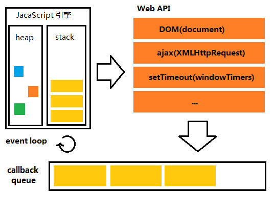

# Event Loop

> The Event Loop is a queue of callback functions.

## JavaScript Engine

想要了解 Event Loop 是怎么工作的，就要先了解一下 JavaScript 引擎是怎么工作的，了解什么是 Call Stack

当 Call Stack 去执行一个 `.js` 文件的时候，每执行到一个新的作用域，Call Stack 就会新建一个任务，跑到那个作用域去执行里面的代码，当这个作用域里面的代码全部执行完之后，这条任务就会被去掉，然后继续执行之前的那条任务。

也就是说，JavaScript 引擎永远执行的是 Call Stack 里最顶端的那条命令。

## Event Loop

因为 JavaScript 是单线程的，那如果在一个任务里，需要进行 IO 的请求呢，需要用户的操作呢，需要处理异步的代码呢。

那我们就要一直等下去吗？ 不是的，因为我们有 callback functions 

我们只要把我们要做的东西，写在回调函数里，浏览器就会帮我们做了，问题是，什么时候做？

JavaScript 每当遇到这些异步的代码的时候，都会把回调函数放到一个队列里，这就是我们的 Event Loop，只有当 Call Stack 为空的时候，Event Loop 才会把他的第一个回调函数放到 Call Stack 里执行。

like this!

## Web API

当我们用一些我们常用的方法的时候，例如 `addEventListeners()`，`console.log()`，`setTimeout()`。谁来帮我们监听呢，谁来帮我们计时呢。就是 Web API 了。所以整个浏览器就像是这样

## Reference

- [What the hack is the event loop anyway](https://www.youtube.com/watch?v=8aGhZQkoFbQ)
- [Understanding Event Loop](http://stackoverflow.com/questions/21607692/understanding-the-event-loop)
- [What Async Has Over Sync](http://code.tutsplus.com/tutorials/event-based-programming-what-async-has-over-sync--net-30027)

you can also play with
[that](http://latentflip.com/loupe/?code=JC5vbignYnV0dG9uJywgJ2NsaWNrJywgZnVuY3Rpb24gb25DbGljaygpIHsKICAgIHNldFRpbWVvdXQoZnVuY3Rpb24gdGltZXIoKSB7CiAgICAgICAgY29uc29sZS5sb2coJ1lvdSBjbGlja2VkIHRoZSBidXR0b24hJyk7ICAgIAogICAgfSwgMjAwMCk7Cn0pOwoKY29uc29sZS5sb2coIkhpISIpOwoKc2V0VGltZW91dChmdW5jdGlvbiB0aW1lb3V0KCkgewogICAgY29uc29sZS5sb2coIkNsaWNrIHRoZSBidXR0b24hIik7Cn0sIDUwMDApOwoKY29uc29sZS5sb2coIldlbGNvbWUgdG8gbG91cGUuIik7!!!PGJ1dHRvbj5DbGljayBtZSE8L2J1dHRvbj4%3D)
